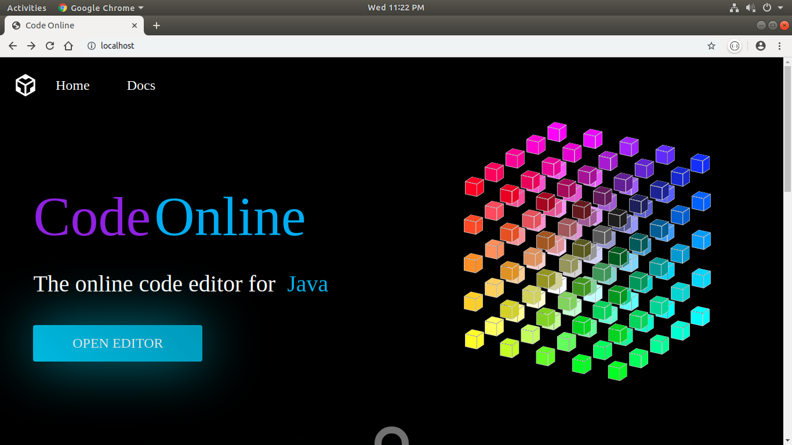
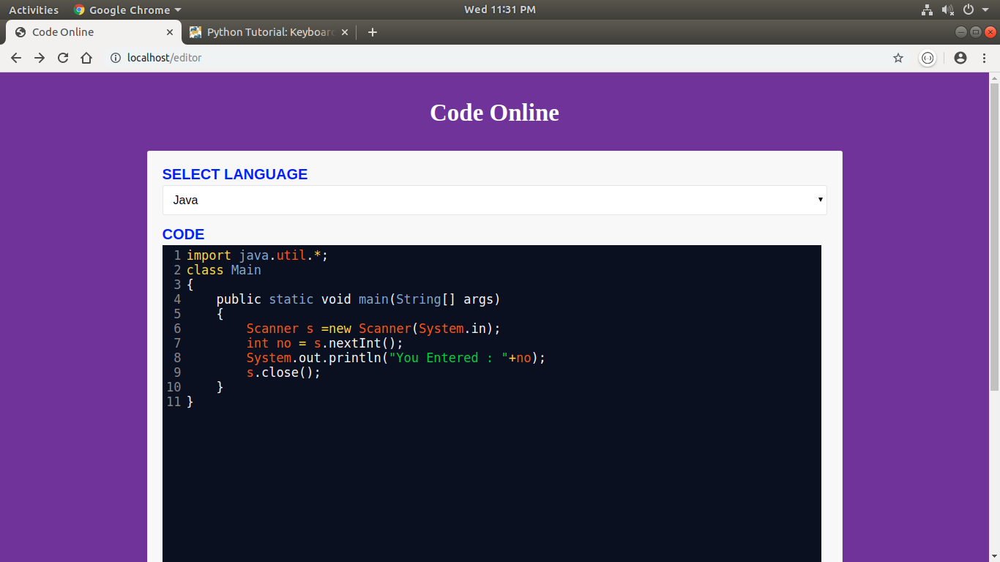
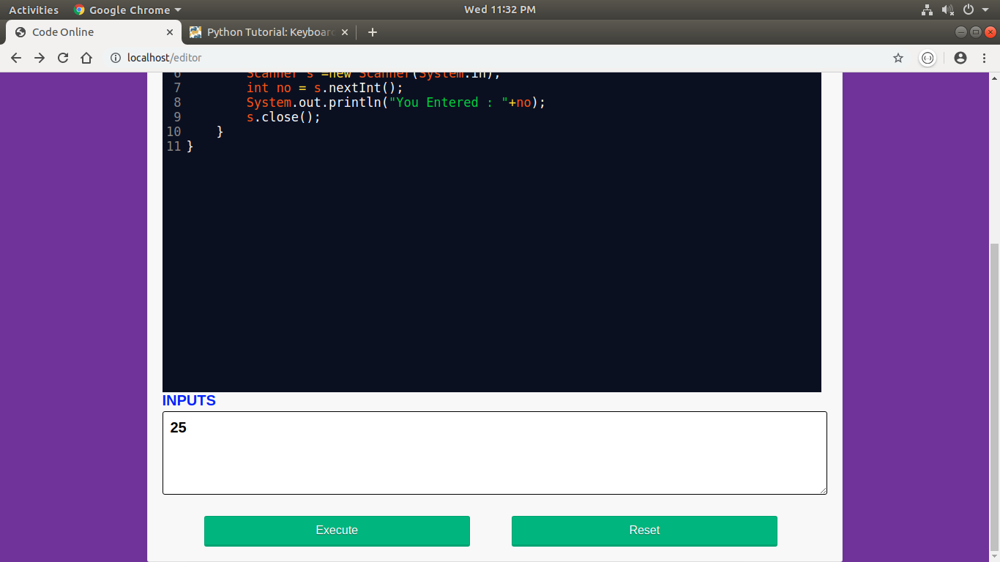
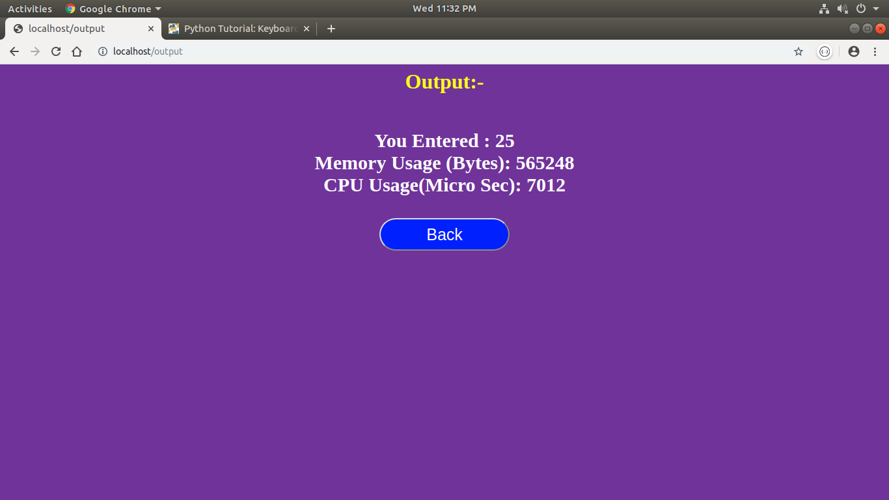

# NodeJS-Online-Compiler
A simple online compiler which is developed using Node.js

## NPM module/package used : https://www.npmjs.com/package/compile-run

## Steps for running this project


#### Step 0: ``` Make sure you have installed and configured all ( C, C++, Java, Python, etc) compilers on your server machine ```
#### Step 1: ``` Download or Clone this repository ```

#### Step 2: ``` Go to root of folder and open a terminal ``` 

#### Step 3: ``` $npm install ```

#### Step 4: ``` $node app.js ```

#### Step 5: ``` Go to browser and type localhost:80 or localhost ```

# Note by default your server will run on port 80

# Screenshots








